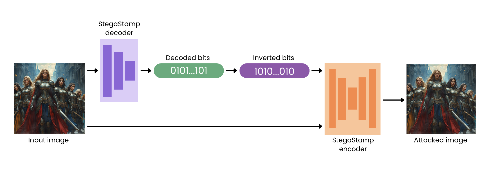

## Overview 

We provide the description for the top two performing strategies used as Beige-box attacks for effectively removing watermarks. In our approach, we performed Watermark Overwriting Attack for the first 150 images (`0.png` to `149.png`) and Rinsing Regeneration Attack for the remaining images (`150.png` to `299.png`). The code release is available in our [repository](https://github.com/leiluk1/erasing-the-invisible-beige-box).

In this markdown file, we will provide the following information: 1. A comprehensive description of the method, 2. Values for parameters and hyperparameters, and 3. Details regarding the implementation setups. Finally, we will include a summary along with a references/links list for both attacks.

### 1. A detailed description of the method used

Firstly, we implemented a Watermark Overwriting Attack for images protected by the StegaStamp algorithm [1]. The StegaStamp algorithm employs a robust encoding and decoding of a binary string of length 100 into images. By leveraging the encoder and decoder networks of StegaStamp, we successfully removed watermarks from the first 150 images (`0.png` to `149.png`). 

As illustrated in the Figure below, our proposed method involved the following steps:
- Recovering the hidden message from the encoded images using the StegaStamp decoder network
- Inverting the bits of the extracted binary message (i.e., converting 0 to 1 and 1 to 0 for all the bits of the message)
- Embedding an inverted message into the images using the StegaStamp encoder network

It turned out that this method completely removed the watermark from the first 150 images, yielding an overall watermark detection performance of 0.5. Additionally, this attack maintained a quite high image quality, with an overall image quality degradation of approximately 0.065.

To attack the Tree-Ring algorithm [2], we implemented Rinsing Regeneration Attack, where an image undergoes multiple cycles of noising and denoising through a pre-trained diffusion model FLUX-dev [3].

In a nutshell, given $X$ as the set of input images, regeneration attacks use off-the-shelf VAEs and diffusion models to transfer a target image $x ∈ X$ to a latent representation $h(x)$ followed by a restoration to (generally, the other image) $x′ \in X$ that is semantically and visually similar to the original image, i.e., x≈x. This attack is based on the following intuition: the VAE or diffusion model chosen to perform the rinsing attack were not used by the owner of the image during its generation and embedding of the watermark. Hence, the entire regeneration is likely to disrupt the latent representation of $x$, thereby damaging an embedded watermark. However, the regeneration of the image may be of reduced quality, partly because of the fact that the capacity of the attacker’s regenerative model may be  inferior to the capacity of the target model (the one originally used to generate watermarked images) [4]. 

For images with watermarks generated by a variant of the Tree-Ring algorithm [2] (`150.png` to `299.png`), we employed the Rinse (2xRegen) technique, as described in [4]. This involved the following steps:
- Using image regeneration with the Flux Img2Img Pipeline on the original images
- Using the Flux Img2Img Pipeline on the regenerated images

### 2. Parameter and hyperparameter values
The rinsing technique utilized the FLUX-dev diffusion model [3] (`FluxImg2ImgPipeline` from `diffusers` library) with the following parameters:
- Prompt: `"original image"`
- Guidance Scale: 10
- Strength: 0.6
- Number of Inference Steps: 10
- Width, height : 512, 512
- Max sequence length: 256
- Generator: `torch.Generator(DEVICE).manual_seed(42)`

### 3. Implementation setups and details
- Clone WAVES repository [5]
- Ensure that all dependencies are installed. This can be done by executing the shell script from the cloned repository: `bash shell_scripts/install_dependencies.sh`
- Login into HuggingFace
- Install libraries: `torch`, `diffusers`, `skimage`, `numpy`
- We used `device = “cuda”`

Source code for watermark overwriting attack and for rinsing attack is available in `stegastamp_attack.ipynb` and `treering_attack.ipynb` in our repository, respectively.

### 4. Summary
In our submission, we modified the first 150 images (`0.png` to `149.png`) by overwriting the watermark, while the remaining 150 images (`150.png` to `299.png`) were attacked using rinsing regeneration (x2). 

### 5. References and links
[1] - Tancik, Matthew, Ben Mildenhall, and Ren Ng. "Stegastamp: Invisible hyperlinks in physical photographs." *Proceedings of the IEEE/CVF conference on computer vision and pattern recognition*. 2020. [Paper](https://arxiv.org/abs/1904.05343)

[2] - Wen, Yuxin, et al. "Tree-ring watermarks: Fingerprints for diffusion images that are invisible and robust." *arXiv preprint arXiv:2305.20030* (2023). [Paper](https://arxiv.org/abs/2305.20030)

[3] - [FLUX-dev model at Hugging Face](https://huggingface.co/docs/diffusers/main/api/pipelines/flux)

[4] - An, Bang, et al. "WAVES: Benchmarking the Robustness of Image Watermarks." Forty-first International Conference on Machine Learning. [Paper](https://arxiv.org/abs/2401.08573)

[5] -  [WAVES repository](https://github.com/umd-huang-lab/WAVES)
